# ERD DIAGRAM - TechShop Database
# Database: computer_shop | Tables: 19 | Relationships: 27
# Copy đoạn code dưới đây và paste vào: https://mermaid.live/

```mermaid
erDiagram
    users ||--o{ orders : "places"
    users ||--o{ orders : "assigned_to (employee)"
    users ||--o{ reviews : "writes"
    users ||--o{ reviews : "replies"
    users ||--o{ carts : "has"
    users ||--o{ wishlist : "has"
    users ||--o{ conversations : "initiates"
    users ||--o{ conversations : "assigned_to (employee)"
    users ||--o{ messages : "sends"
    users ||--o{ user_addresses : "has"
    users ||--o{ notifications : "receives"
    users ||--o{ order_history : "creates"
    users ||--o{ contacts : "replies_to"
    
    categories ||--o{ categories : "parent_of"
    categories ||--o{ products : "contains"
    
    brands ||--o{ products : "has"
    
    products ||--o{ product_images : "has"
    products ||--o{ product_specifications : "has"
    products ||--o{ order_items : "ordered_in"
    products ||--o{ reviews : "reviewed_in"
    products ||--o{ cart_items : "added_to"
    products ||--o{ wishlist : "added_to"
    
    orders ||--o{ order_items : "contains"
    orders ||--o{ reviews : "has"
    orders ||--o{ order_history : "has"
    
    carts ||--o{ cart_items : "contains"
    
    conversations ||--o{ messages : "has"

    users {
        int id PK
        varchar name
        varchar email UK
        varchar password
        varchar phone
        enum role
        enum status
        varchar avatar
        varchar google_id
        tinyint email_verified
        varchar verification_token
        varchar remember_token
        datetime token_expiry
        varchar reset_token
        datetime reset_expiry
        datetime last_login
        timestamp created_at
        timestamp updated_at
        date birthday
        enum gender
    }

    categories {
        int id PK
        varchar name
        varchar slug UK
        text description
        varchar image
        int parent_id FK
        int sort_order
        enum status
        timestamp created_at
        timestamp updated_at
    }

    brands {
        int id PK
        varchar name
        varchar slug UK
        varchar logo
        text description
        enum status
        int sort_order
        timestamp created_at
        timestamp updated_at
    }

    products {
        int id PK
        varchar name
        varchar slug
        text description
        text specifications
        varchar short_description
        decimal price
        decimal sale_price
        int category_id FK
        varchar brand
        int brand_id FK
        varchar sku
        int stock
        tinyint featured
        enum status
        decimal rating
        int review_count
        int sold_count
        int views
        timestamp created_at
        timestamp updated_at
    }

    product_images {
        int id PK
        int product_id FK
        varchar image_url
        tinyint is_primary
        int sort_order
        timestamp created_at
    }

    product_specifications {
        int id PK
        int product_id FK
        varchar spec_name
        varchar spec_value
        int sort_order
    }

    orders {
        int id PK
        varchar order_number UK
        int user_id FK
        varchar customer_name
        varchar customer_email
        varchar customer_phone
        text shipping_address
        varchar shipping_ward
        varchar shipping_district
        varchar shipping_city
        decimal subtotal
        decimal shipping_fee
        decimal discount
        decimal total
        enum payment_method
        enum payment_status
        enum status
        text note
        text admin_note
        int assigned_employee FK
        varchar cancelled_reason
        datetime delivered_at
        timestamp created_at
        timestamp updated_at
    }

    order_items {
        int id PK
        int order_id FK
        int product_id FK
        varchar product_name
        varchar product_image
        varchar product_sku
        decimal price
        int quantity
        decimal total
    }

    order_history {
        int id PK
        int order_id FK
        enum old_status
        enum new_status
        text note
        int created_by FK
        timestamp created_at
    }

    reviews {
        int id PK
        int product_id FK
        int user_id FK
        int order_id FK
        tinyint rating
        varchar title
        text content
        text pros
        text cons
        enum status
        int helpful_count
        text reply
        int reply_by FK
        datetime reply_at
        timestamp created_at
        timestamp updated_at
    }

    carts {
        int id PK
        int user_id FK
        varchar session_id
        timestamp created_at
        timestamp updated_at
    }

    cart_items {
        int id PK
        int cart_id FK
        int product_id FK
        int quantity
        timestamp created_at
        timestamp updated_at
    }

    wishlist {
        int id PK
        int user_id FK
        int product_id FK
        timestamp created_at
    }

    conversations {
        int id PK
        int user_id FK
        int assigned_to FK
        varchar subject
        enum status
        datetime last_message_at
        timestamp created_at
        timestamp updated_at
    }

    messages {
        int id PK
        int conversation_id FK
        int sender_id FK
        enum sender_type
        text content
        varchar image
        tinyint is_read
        datetime read_at
        timestamp created_at
    }

    contacts {
        int id PK
        varchar name
        varchar email
        varchar phone
        varchar subject
        text message
        enum status
        int replied_by FK
        datetime replied_at
        timestamp created_at
    }

    coupons {
        int id PK
        varchar code UK
        varchar name
        text description
        enum discount_type
        decimal discount_value
        decimal min_order
        decimal max_discount
        int usage_limit
        int used_count
        datetime start_date
        datetime end_date
        enum status
        timestamp created_at
        timestamp updated_at
    }

    user_addresses {
        int id PK
        int user_id FK
        varchar full_name
        varchar phone
        text address
        varchar ward
        varchar district
        varchar city
        tinyint is_default
        timestamp created_at
        timestamp updated_at
    }

    notifications {
        int id PK
        int user_id FK
        varchar type
        varchar title
        text message
        varchar link
        tinyint is_read
        datetime read_at
        timestamp created_at
    }
```

## HƯỚNG DẪN SỬ DỤNG:

1. **Xem trực tuyến**: 
   - Vào https://mermaid.live/
   - Copy đoạn code Mermaid trên
   - Paste vào editor
   - Sơ đồ ERD sẽ hiển thị tự động

2. **Export**: 
   - Có thể export sang PNG, SVG, PDF
   - Sử dụng cho báo cáo, tài liệu

3. **Chỉnh sửa**:
   - Bổ sung thêm bảng nếu cần
   - Thay đổi relationships
   - Thêm/bớt attributes
